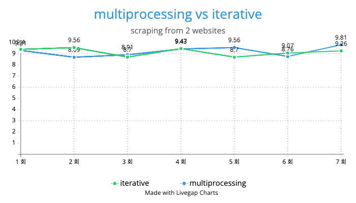
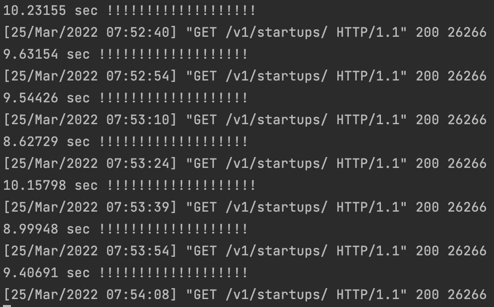
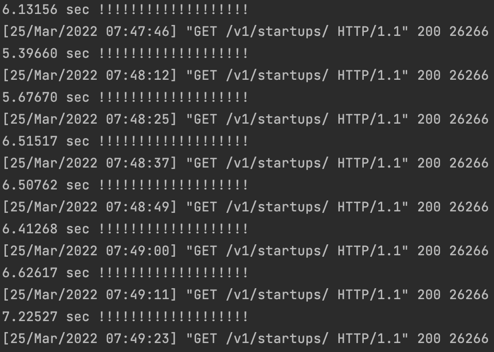
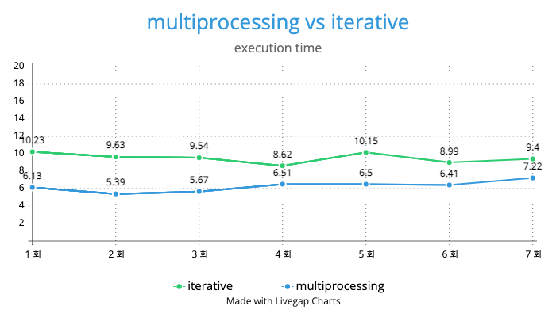

# Tart Assignment


## Environment

- run on localhost
- python 3.9.10
  - cannot use `ray` on python 3.8.2 environment


## Prerequisite

- Make a virtual environment

  ```shell
  $ cd tart_assignment
  $ python3 -m venv myvenv
  ```

- Run a virtual environment

  ```shell
  (myvenv) ~/tart_assignment $ source myvenv/bin/activate
  ```

- Install requirements

  - install requirements

    ```shell
    (myvenv) ~$ pip install -r requirements.txt
    ```

  - pip upgrade

    ```shell
    (myvenv) ~$ python3 -m pip install --upgrade pip
    ```

    

## Usage

```shell
(myvenv) ~/tart_assignment $ python manage.py migrate
```

```shell
(myvenv) ~/tart_assignment-deploy$ python manage.py runserver
```


## Multiprocessed vs Iterative

- Do web-crawling in 2 websites

  - Do web-crawling interatively &

  - Do web-crawling by multiprocessing using ray


- Code iterative

```python
def mk_result_iteratively(self):
  start = time.time()
  merged_info = []
  for platform in self.Platforms:
    merged_info.extend(self.get_info_directly(platform, status))
  end = time.time()
  print(f"{end - start:.5f} sec", "!!!!!!!!!!!!!!!!!!!")

  return merged_info
```


- Code Multiprocessing

```python
def mk_result_using_multiprocessing(self):
  start = time.time()
  merged_info = []
  for platform in self.Platforms:
    merged_info.extend(ray.get(get_info_async.remote(ListView(), platform=platform, status=status)))
  end = time.time()
  print(f"실행 시간 : {end - start:.5f} sec", "!!!!!!!!!!!!!!!!!!!")
  
  return merged_info
```


- **Expectation**
  - Expect a significant difference **in execution time**.

- **Result**

  

  - There was **no significant difference..** 😢
  - ~~Why? Something wrong..?~~

- **Troubleshooting**
  - 문제 원인
    - `ray.get()`을 연속적으로 for문을 통해서 호출을 한 것. 
    - 이렇게 연속적으로 `ray.get()`을 호출하게 되면, **나중에 호출된 `ray.get()`은 앞서 호출된 `ray.get()`의 작업이 끝날때 까지 기다림!!**
  - 해결
    - `[FUNCTION].remote()`를 순차적으로 호출하는 것이고! `ray.get()`은 한 번만 호출!

- **New Result**

  - **Iterative Result**

    

  - **Multiprocessing Result**

    

  - **Chart**

    

    - There was **the significant difference!** 😄

  
